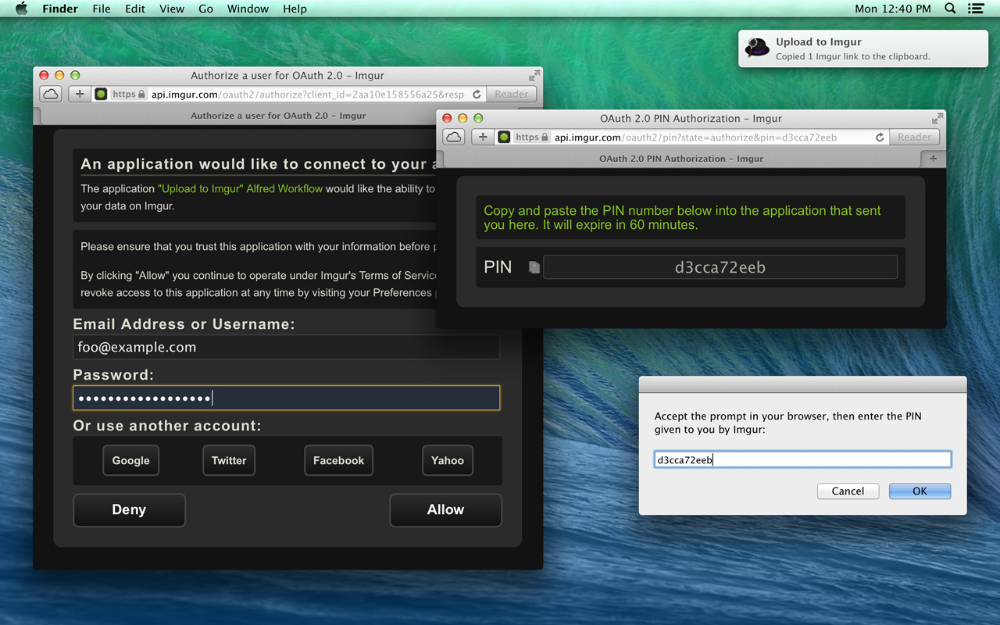

### Upload to Imgur

An [Alfred](http://www.alfredapp.com) workflow for uploading images to your [Imgur](http://imgur.com) account.

### Installation

To install the workflow, download [the latest release](https://github.com/raws/alfred-imgur/releases) and double-click the workflow file. Alfred will install it automatically.

### Usage

Select one or more image files in the Finder and press the global keyboard shortcut specified in the Alfred workflow.

The first time you use the workflow, you'll be prompted to authorize your Imgur account by entering a PIN into a Finder dialog.

Your browser will open automatically and walk you through Imgur's authorization flow. If you accept, Imgur will provide you with a PIN that you should enter into the dialog.

After the image is successfully uploaded, you will receive a notification that its Imgur link has been copied to your clipboard.

### Troubleshooting

The workflow records all uploads and errors to:

    ~/Library/Logs/com.rosspaffett.alfred.imgur.log

You can view the log using Console.

### Contributors

* [Donni Katzovicz](https://github.com/raws/alfred-imgur/commits?author=DolandJW)
* [Ross Paffett](https://github.com/raws/alfred-imgur/commits?author=raws)

### License

(The MIT license)

Copyright (c) 2014 Ross Paffett

Permission is hereby granted, free of charge, to any person obtaining a copy of this software and associated documentation files (the "Software"), to deal in the Software without restriction, including without limitation the rights to use, copy, modify, merge, publish, distribute, sublicense, and/or sell copies of the Software, and to permit persons to whom the Software is furnished to do so, subject to the following conditions:

The above copyright notice and this permission notice shall be included in all copies or substantial portions of the Software.

THE SOFTWARE IS PROVIDED "AS IS", WITHOUT WARRANTY OF ANY KIND, EXPRESS OR IMPLIED, INCLUDING BUT NOT LIMITED TO THE WARRANTIES OF MERCHANTABILITY, FITNESS FOR A PARTICULAR PURPOSE AND NONINFRINGEMENT. IN NO EVENT SHALL THE AUTHORS OR COPYRIGHT HOLDERS BE LIABLE FOR ANY CLAIM, DAMAGES OR OTHER LIABILITY, WHETHER IN AN ACTION OF CONTRACT, TORT OR OTHERWISE, ARISING FROM, OUT OF OR IN CONNECTION WITH THE SOFTWARE OR THE USE OR OTHER DEALINGS IN THE SOFTWARE.
